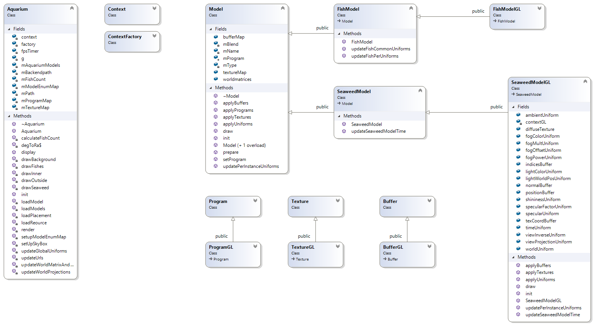

#  Design Doc of Native Aquarium
 The Goal of Native Aquarium is to compare performance between native and web and also different backends such as OpenGL, D3D12, Vulkan, Dawn, etc.

 The difference between WebGL Aquarium and Native Aquarium includes data structure which is optimized, essential features of the two coding language, libs from the third parties and difference between WebGL and OpenGL.

# Data structure design of Native aquarium
The data structure has been optimized to reach the best performance on desktop. And the structure is designed to have different backends coexist in the same solution so that logical code can be shared by all of the backends while graphics related codes are seperated in subclasses.

1. Resource binding
   *  Uniforms and attributes in WebGL is queried by getActiveUniforms and getActiveAttributes. They are stored in dictionaries(something like std::map in C++). And they are applied to programs using a loop. For example:

   ```sh
   #   Using shader reflection
   for (int i = 0; i < params; ++i)
{
		glGetActiveUniform(program, i, 1024, &length, &size, &type, name);
		string namestr(name);
		GLint index = glGetUniformLocation(program, name);
        ASSERT(index != -1);
        uniforms[namestr] = new Uniform(namestr, type, length, size, index);
}
```
```sh
  # set texture Uniforms
  void Program::setUniform(const string& name, Texture* texture)
{
	if (uniforms.find(name) == uniforms.end())
	{
		return;
	}

	Uniform *uniform = uniforms[name];
	GLenum type = uniform->getType();
	ASSERT(type == GL_SAMPLER_2D || type == GL_SAMPLER_CUBE);
        GLint loc = uniform->getIndex();

	glUniform1i(loc, textureUnits[name]);
	glActiveTexture(GL_TEXTURE0 + textureUnits[name]);
	ASSERT(textureUnits[name] < 16);
	glBindTexture(texture->getTarget(), texture->getTexture());

	ASSERT(glGetError() == GL_NO_ERROR);
}
   ```

   However, shader reflection is not supported by other backends such as Dawn and Vulkan. Vulkan supposes uniform index to be known and should be hard coded. And uniform blocks are ultilized in Vulkan, so uniforms can't be stored in data structure like map and can't be set to program using a loop either. Currently, glGetUniformLocation is used to map WebGL 1.0 to native OpenGL.

   ```sh
   # index of uniforms are queried one by one
   viewInverseUniform.second =
        contextGL->getUniformLocation(programGL->getProgramId(), "viewInverse");
   # uniforms are set one by one
   contextGL->setUniform(viewInverseUniform.second, viewInverseUniform.first, GL_FLOAT_MAT4);
   ```


2. Classify different backends

   In order to make many backends coexist in the same solution, abstract classes are used to classify different backends. Such as Texture and TextureGL, Program and ProgramGL, FishModel and FishModelGL. Common functions are written in base class while graphics related functions are written in sub classes. For example, loading image files is common to all of the backends.
   Graphics related calls are written in Context{backend}.

3. Optimization

   To reach the best performance on desktop, data structure is optimized.
   * Some std::map are replaced by std::pair, such as std::map<name, Uniform> is replaced by std::pair. Uniforms are set one by one which removed map iteration and name string comparison.


#  Difference between js and C++
1.	Coding style difference of variables.

 In js all variables are var, they could be a vector, map, struct, class, basic c++ types or any valid combination of them.
    * Some vars are converted to struct arrays. For example:

      ```sh
      var g_fishTable = [
        {
          name: 'SmallFishA',
          speed: 1,
          speedRange: 1.5,
          radius: 30,
          radiusRange: 25,
          tailSpeed: 10,
          heightOffset: 0,
          heightRange: 16,
          constUniforms: {
            fishLength: 10,
            fishWaveLength: 1,
            fishBendAmount: 2
          }
        },
        ...
    ```

    On C++ side,

    ```sh
    static Fish g_fishTable[] = { { "SmallFishA", 1.0f, 1.5f, 30.0f, 25.0f, 10.0f, 0.0f, 16.0f, 10.0f, 1.0f, 2.0f },
    { "MediumFishA", 1.0f, 2.0f, 10.0f, 20.0f, 1.0f, 0.0f, 16.0f, 10.0f, -2.0f, 2.0f },
    { "MediumFishB", 0.5f, 4.0f, 10.0f, 20.0f, 3.0f, -8.0f, 5.0f, 10.0f, -2.0f, 2.0f },
    { "BigFishA", 0.5f, 0.5f, 50.0f, 3.0f, 1.5f, 0.0f, 16.0f, 10.0f, -1.0f, 0.5f, true, 0.04f,{ 0.0f, 0.1f, 9.0f },{ 0.3f, 0.3f, 1000.0f } },
    { "BigFishB", 0.5f, 0.5f, 45.0f, 3.0f, 1.0f, 0.0f, 16.0f, 10.0f, -0.7f, 0.3f, true, 0.04f,{ 0.0f, -0.3f, 9.0f },{ 0.3f, 0.3f, 1000.0f } } };
   ```

2.  Data type of elements of matrix or vector are converted from var to a certain type. In js code, types can be dynamically defined but C++ is a type-restrict language. For example:

```sh
this.buffer = new type(numElements);   // Primitives.js :: 63 type can be Uint8Array, Float32Array, etc.
```

On C++ side,
All data type of matrix and vector is maintained as a certain type.

3.	Some vars are converted to C++ Class
    Texture, Program, Buffer, Model is defined as a class in C++.

4. On js side, some function parameters are var and can pass uncertain types of variables. On C++
side function parameter type is defined, for example:

```sh
void ContextGL::setUniform(int index, const float *v, int type) const
```

5. On C++, new and delete are in pair, but destroy variables on heap isn’t needed in js.

#  Difference between WebGL and OpenGL
1. Use glfw, glad OpenGL framework instead of creating webgl context in an html canvas.

2. gl.pixelStorei(gl.UNPACK_FLIP_Y_WEBGL, true). The enum doesn’t exist in OpenGL, use function of stb stbi_set_flip_vertically_on_load instead.

# Third party libs
*	Difference in loading resources and creating context, using third party libraries
    * stb  is a light weight lib to load images from file.
    * rapid json is an efficient lib maintained by tencent to parse json file.
    * glfw is an OpenGL framework
    * glad is an OpenGL loader.

#  Other differences
*  Move variables or files to other files
    * Shaders are moved from aquarium.html into shaders folder.
    * global variables in aquarium.js and aquarium-common.js are moved to Globals.h
